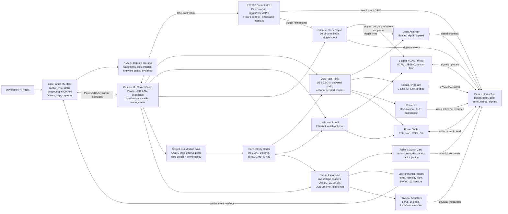

# ScopeLoop Hardware Spec

ScopeLoop hardware is a bring-your-own-hardware AI harness for an embedded test
bench. It should coordinate the DUT, firmware, power, reset, triggers,
instruments, fixtures, environmental probes, and evidence capture without
trying to replace calibrated scopes, analyzers, power supplies, or Moku-style
software-defined instruments.

## Product Target

- Self-build hardware target: under $500 without a screen.
- Current early line-item estimate: about $343 using an $89 carrier, $199
  LattePanda Mu N100 16 GB RAM module, $10 heatsink, $39 power supply, and $6
  Pi Pico 2.
- Risk: a custom carrier board may cost more at low volume than LattePanda's
  off-the-shelf carrier.
- Commercial path: a kit or finished device may depend on wholesale Mu module
  pricing to absorb enclosure, assembly, support, test, and margin.

## System Roles

| Role | Responsibility |
| --- | --- |
| Mu host | Runs ScopeLoop, MCP/API services, drivers, captures, logs, and test recipes. |
| Custom carrier | Provides USB/LAN, power, RP2350 control, protected I/O, trigger, and expansion connectors. |
| RP2350 control MCU | Owns deterministic low-latency trigger, reset, relay, GPIO, and fixture-control operations. |
| Bench instruments | BYO scopes, logic analyzers, power supplies, debuggers, power profilers, cameras, and Moku devices. |
| Fixture layer | Optional physical actuation and environmental probe modules around the DUT. |

## Hardware Block Diagram



## Fixture Layer Definition

Fixtures are not normal bench instruments. They are the physical layer around
the DUT that manipulates or observes conditions a test recipe cares about.

Examples:

- Relays to short button pads or open/close circuits.
- MOSFET/load-switch paths for power cycling, rail disconnects, or fault injection.
- Qwiic/STEMMA QT sensors for temperature, humidity, pressure, light, and motion.
- 1-Wire temperature probes for fixture or enclosure temperature.
- FLIR/USB thermal cameras and USB cameras for board heat, LEDs, displays, and motion.
- Solenoids, servos, or motor drivers for physical button presses or knob movement.
- GPIO expanders, ADCs, DACs, and small custom fixture cards.

Every fixture should be described by capabilities instead of ad hoc scripts.
A capability has a name, kind, direction, connection, safety state, active
state, limits, and optional calibration metadata.

```yaml
fixtures:
  relay_card:
    type: relay-card
    connection:
      type: carrier-gpio
      controller: rp2350
      path: J5
      voltage: "3.3V control"
    capabilities:
      - name: power_button
        kind: button
        channel: RELAY1
        direction: output
        signal: "Short DUT power-button pads"
        safe_state: open
        active_state: closed
      - name: battery_disconnect
        kind: relay
        channel: RELAY2
        direction: output
        signal: "DUT battery positive lead"
        safe_state: closed
        active_state: open
        limits:
          max_voltage_v: 24
          max_current_a: 2

  qwiic_environment:
    type: qwiic-sensor-chain
    connection:
      type: qwiic
      controller: rp2350
      path: QWIIC0
    capabilities:
      - name: ambient_temperature
        kind: temp-probe
        direction: input
        unit: degC
      - name: status_led_light
        kind: light-sensor
        direction: input
        unit: lux
```

## Hardware Architecture Options

### Option 1: Carrier-Integrated Fixture I/O

Put the common fixture capabilities directly on the custom Mu carrier.

Good for:

- Always-available reset, boot, and trigger lines.
- A small number of protected GPIOs.
- A few relay or solid-state switch outputs.
- One Qwiic/STEMMA QT sensor bus.
- One 1-Wire temperature probe input.

Tradeoff: easiest user experience, but every added fixture feature increases
carrier complexity, validation effort, BOM cost, and board area.

### Option 2: Modular Fixture Cards

Keep the carrier board focused and expose one or more expansion connectors for
fixture cards.

Good for:

- Relay cards.
- Sensor cards.
- Environmental cards.
- Camera/light cards.
- DUT-specific fixture cards.

Tradeoff: more flexible and cleaner for low-volume iteration, but it requires a
card manifest, mechanical convention, cable/connector discipline, and safety
rules for each card type.

### Option 3: Separate Fixture Hub

Make fixture I/O a separate optional device connected to the Mu host over USB,
Ethernet, or a robust field bus.

Good for:

- Users who do not need fixture I/O.
- Higher channel counts.
- Isolation between DUT wiring and the Mu carrier.
- Lab-specific or production-test fixtures.
- Future fixture boxes that can evolve independently from the Mu carrier.

Tradeoff: adds another box and cable, but gives the cleanest optionality and
lets the carrier stay closer to a host/backplane role.

### Option 4: Framework-Style Module Bays

Add a few small user-swappable module bays to the ScopeLoop carrier or front
panel. The closest reference model is Framework's laptop Expansion Card system:
small cards slide into a mechanical bay and connect through USB-C underneath.
For ScopeLoop, the useful idea is the user-buildable card ecosystem, not
necessarily the USB-C connector itself. The same product pattern can be built
with a custom backplane, card-edge connector, board-to-board mezzanine connector,
or separate fixture hub.

Good for:

- Swappable front-panel connectivity: USB-A, USB-C, Ethernet, serial, CAN,
  RS-485, isolated GPIO, or Qwiic.
- Test-fixture cards: relay/switch card, temperature/light sensor card, small
  ADC card, camera trigger card, or DUT-specific adapter card.
- Letting users buy or build only the I/O they need.
- Keeping the base carrier stable while iterating quickly on small modules.

Primary reason: make adapter cards user-buildable. ScopeLoop should publish
enough mechanical, electrical, firmware, and manifest detail that a hardware
user can design a card, plug it into a bay, and have ScopeLoop identify what
capabilities it adds.

Tradeoff: module bays need real mechanical design, retention, labeling, card
detection, power budgeting, ESD protection, and a clear software manifest.
USB-C is convenient and cheap, but using a USB-C connector with a non-USB-C
pinout creates avoidable confusion and damage risk. If the slot needs multiple
rails, trigger lines, clocks, analog references, and mixed data buses, a custom
backplane or card-edge connector is probably cleaner.

Recommended slot classes:

| Slot Class | Electrical Interface | Use |
| --- | --- | --- |
| USB module slot | USB 2.0 or USB 3.x over a compliant USB-C or internal connector | USB-A/C cards, serial adapters, cameras, microcontroller fixture cards. |
| Control module slot | USB 2.0 plus RP2350 GPIO/trigger sideband | Relay, trigger, reset, isolated GPIO, and fixture-control cards. |
| Sensor module slot | I2C/Qwiic plus power and ID | Temperature, light, humidity, pressure, ADC, and simple environmental probes. |
| Backplane module slot | Custom connector with power rails, USB, I2C/UART/SPI, trigger, clock, and optional analog pins | Higher-capability user cards that need more than simple USB. |
| Robust fixture slot | USB or UART plus optional CAN/RS-485 | Longer cable runs, external fixture boxes, or production-style fixtures. |

Practical first revision: expose two to four module bays, but make only one or
two fully populated. Start with a USB/control hybrid slot and a sensor slot.
That gives the product the Framework-like modular story while keeping the first
board routable and debuggable.

## Connector / Backplane Decision

Do not make modularity a v1 tax. If the elegant version is not obvious, keep
the first carrier simple and expose ordinary USB, Qwiic, GPIO, trigger, and
fixture headers. A module bay is valuable only if it makes user-built cards
easier without forcing every ScopeLoop owner to pay for unused complexity.

Connector options:

| Connector Approach | When It Makes Sense | Main Risk |
| --- | --- | --- |
| Compliant USB-C | The card is really a USB device or passive USB adapter. | Limited rails/sideband unless using complex Type-C behavior. |
| USB-C shell with custom pinout | Mostly a mechanical choice for internal-only cards. | Users may plug it into normal USB-C and damage hardware unless strongly keyed/prevented. |
| Board-to-board mezzanine | Compact internal modules with many signals and rails. | Mechanical tolerance, sourcing, and enclosure complexity. |
| Card-edge/backplane | More signals, multiple rails, clear non-USB identity, user-buildable PCBs. | Larger mechanical design and retention work. |
| External fixture hub | High channel count, isolation, or hazardous switching. | Extra box and cable. |

For the open adapter-card goal, the strongest concept is a custom backplane or
card-edge slot with a public pinout. It can expose rails and data without
pretending to be USB-C:

- Power: 3.3 V logic, 5 V accessory, optional 12 V fixture rail, optional
  negative/analog rail only on a future high-capability slot.
- Data: USB 2.0 minimum for identification/control, optional USB 3.x for
  cameras or high-throughput cards, I2C for ID/sensors, UART/SPI for simple
  controller cards.
- Timing/control: RP2350 GPIO, trigger in/out, timestamp marker, optional
  10 MHz reference on advanced slots.
- Identity: EEPROM, USB descriptor, or manifest file/API.
- Safety: card-detect, power enable, current limit, ESD protection, and default
  high-Z/off safe state.

High-capability cards such as AWG or single-channel scope cards are possible in
principle, but they are a different tier. They need analog front ends, ADC/DACs,
low-noise rails, references, shielding, calibration, bandwidth budgeting, and
real data throughput. The base carrier should not depend on that tier early.

Recommended tiering:

| Tier | Purpose | Keep In V1? |
| --- | --- | --- |
| Tier 0 external | USB/LAN/Qwiic/GPIO headers and external instruments. | Yes. |
| Tier 1 simple cards | Low-cost user cards: USB, serial, Qwiic, relay, isolated GPIO, sensors. | Maybe, if mechanically simple. |
| Tier 2 fixture cards | More DUT-facing cards with extra rails, trigger, GPIO, and current limits. | Prototype only unless clearly useful. |
| Tier 3 instrument cards | AWG/scope/DAQ cards with analog rails, clocking, calibration, and high bandwidth. | No, keep as future/backplane research. |

## Open Adapter Card Ecosystem

The module system should be designed as an open adapter-card ecosystem, not
only as a way for ScopeLoop to sell first-party accessories.

Public artifacts to provide:

- Mechanical card envelope, keepouts, retention features, and front-panel label
  area.
- Connector choice, pinout, slot classes, voltage rails, current limits, ESD
  expectations, and hot-plug policy.
- Reference cards: USB-A/C, serial/UART, Qwiic sensor, relay/switch, and
  isolated GPIO.
- KiCad templates and mechanical CAD for user-built cards.
- RP2350/fixture-hub firmware examples for cards with microcontrollers.
- Module manifest schema and examples.
- Validation checklist for safe-state behavior, current draw, card detection,
  and capability reporting.

Adapter cards should be able to identify themselves by EEPROM, USB descriptor,
manifest file, or fixture-hub API. The minimum manifest is:

```yaml
modules:
  relay_card_m1:
    slot: M1
    type: relay-card
    connection:
      type: module-bay
      controller: rp2350
      path: M1
    manifest:
      module_id: "scopeloop.relay-card.4ch"
      name: "4-Channel Relay Card"
      vendor: "ScopeLoop"
      hardware_revision: "A"
      slot_class: control
      electrical_interface: "usb2+gpio"
      open_hardware: true
      source_url: "https://github.com/example/scopeloop-relay-card"
      license: "CERN-OHL-S-2.0"
      power_budget_w: 2.5
      rails:
        - name: 5v
          voltage: "5V"
          max_current_a: 0.3
          purpose: "relay coils"
        - name: 3v3
          voltage: "3.3V"
          max_current_a: 0.05
          purpose: "logic"
      interfaces:
        - name: usb2
          type: usb2
          purpose: "module identification and control"
        - name: trigger_out
          type: trigger
          direction: output
          optional: true
          purpose: "timestamped relay action marker"
      requires_safe_state: true
      capabilities:
        - name: relay_1
          kind: relay
          channel: RELAY1
          direction: output
          safe_state: open
          active_state: closed
          limits:
            max_voltage_v: 24
            max_current_a: 2
```

Compatibility levels:

| Level | Meaning |
| --- | --- |
| First-party | Designed, tested, and supported by ScopeLoop. |
| Reference | Open design published by ScopeLoop, user-buildable, known-good when built as specified. |
| Community | User-created card with a valid manifest and basic validation evidence. |
| Experimental | Works in a known setup but has incomplete validation or safety data. |

This makes the module bay more than a port adapter system. It becomes a
hardware extension API for the physical test bench.

## Recommended Direction

Use a hybrid path:

1. Put only foundational controls on the carrier: RP2350, reset/boot lines,
   protected GPIO, trigger in/out, one Qwiic/STEMMA QT connector, and headers
   or module bays for low-voltage relay/control expansion.
2. Treat relays, sensors, FLIR/USB cameras, and environmental probes as
   fixture modules in software from day one.
3. Prefer modular fixture cards or small USB-C-style module bays for common use
   cases rather than making the first carrier board absorb every fixture idea.
4. Leave room for a separate fixture hub if channel count, isolation, or
   customization becomes the product.

This keeps the first custom carrier board useful without making it a one-off
test-fixture motherboard.

## Carrier Board Baseline

Minimum useful carrier functions:

- LattePanda Mu module socket and power.
- NVMe/storage support if not already handled by the carrier/module stack.
- Enough USB host ports for instruments, debuggers, cameras, serial adapters,
  and fixture devices.
- Ethernet for LAN instruments, preferably routed so devices can sit behind a
  small switch.
- RP2350 connected to the host over USB.
- RP2350-controlled reset, boot, trigger, GPIO, and fixture-control headers.
- Trigger input and trigger output with clear voltage limits.
- Optional 10 MHz reference input/output path for instruments that support it.
- Qwiic/STEMMA QT I2C connector for low-speed sensors.
- Protected low-voltage GPIO header for simple fixtures.
- Optional module bay footprints for swappable connectivity or fixture cards.
- Mechanical mounting and cable strain relief for bench use.

Nice-to-have carrier functions:

- Relay or solid-state switch footprints for two to four low-voltage channels.
- 1-Wire temperature probe header.
- External fixture expansion connector.
- Card-detect or ID EEPROM support for module bays.
- Per-port power switching for selected USB or DUT ports.
- Fixture EEPROM or ID pin support.
- Front-panel status LEDs for host, RP2350, trigger, fixture power, and safety state.

## Expansion Bus Guidance

Use the right bus for the job:

| Bus | Best Use | Avoid For |
| --- | --- | --- |
| Qwiic/STEMMA QT I2C | Low-speed sensors and small GPIO expanders. | Long cables, noisy relay wiring, safety-critical controls. |
| Carrier GPIO | Short, deterministic trigger/reset/relay control. | Unprotected external cabling or unknown voltage domains. |
| USB | Cameras, FLIR devices, fixture microcontrollers, debuggers. | Hard real-time synchronization without extra trigger lines. |
| Ethernet | LAN instruments, remote fixture hubs, high-level control. | Sub-millisecond physical timing by itself. |
| 1-Wire | Temperature probes. | Complex fixture control. |
| CAN/RS-485 | Future robust fixture hubs or longer cable runs. | First-revision complexity unless needed. |

## Module Bay Rules

- Make each module self-describing in software: module type, serial, slot,
  capabilities, power budget, safe state, and calibration data.
- Treat the module interface as a public contract. If users are expected to
  build cards, the pinout, mechanical envelope, slot classes, and manifest
  schema need to be versioned.
- Separate physical connector compatibility from electrical capability. A
  USB-C-shaped connector can carry plain USB 2.0, USB 3.x, I2C sideband, UART,
  or GPIO, but the slot must label what it actually supports.
- Avoid nonstandard USB-C pinouts for anything users could accidentally plug
  into a normal USB-C device. If a USB-C-shaped connector is used for custom
  signals, make it mechanically captive, keyed, clearly labeled, and treated as
  an internal backplane connector rather than a public USB-C port.
- Prefer low-voltage, current-limited, protected module interfaces.
- Default module outputs to safe states until ScopeLoop has identified the card
  and loaded its manifest.
- Treat high-power, high-voltage, or mains switching as external fixture-hub
  territory until a dedicated safety design exists.
- Key or label module bays so users do not confuse host USB connectivity cards
  with DUT-facing relay/control cards.

## Safety Rules

- Every output capability needs a documented safe state.
- Relay and switch channels need voltage/current limits in the fixture manifest.
- Default power-up state should be safe: open, off, high-Z, or explicitly defined.
- Keep mains and hazardous voltages out of first-party fixture hardware unless a
  dedicated safety design is created.
- Treat Qwiic and similar sensor buses as convenience expansion, not a protected
  industrial field bus.
- Test recipes should refuse to run fixture actions when required safety limits,
  fixture identity, or calibration data are missing.

## Software Contract

The `fixtures` section in `scopeloop.yaml` is the software contract between the
hardware and the agent. Drivers can evolve later, but the manifest should be
stable enough for test recipes to target capabilities by name.

Example recipe language:

```text
Use fixture.relay_card.power_button to press the DUT power button for 500 ms,
then use fixture.qwiic_environment.status_led_light to verify the LED turns on.
```

Driver implementation should map those capability names to concrete RP2350
commands, I2C reads, USB camera captures, or fixture-hub API calls.

## References

- [Framework Expansion Cards reference designs](https://github.com/FrameworkComputer/ExpansionCards)
- [Framework USB-C Expansion Card](https://frame.work/products/usb-c-expansion-card)
- [Framework storage expansion card deep dive](https://frame.work/blog/storage-expansion-cards)
